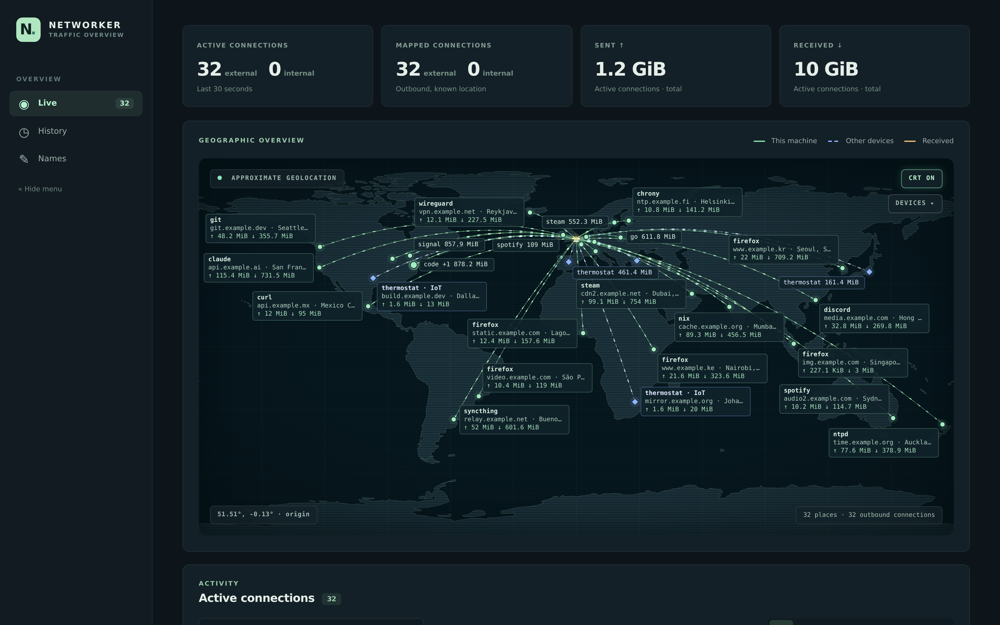

# Networker

Linux-only local traffic collector. Go 1.27. Small eBPF programs observe host TCP/UDP
flows (IPv4 and IPv6), collect approximate byte counts, and associate sockets
with processes when possible. Optionally, it also reads a MikroTik RouterOS 7
router's REST API (read-only) to show other LAN devices' connections, VLANs,
DHCP names and DNS-cache domains. Packet payloads are never recorded.



## Run

eBPF program loading and root-cgroup attachment require suitable Linux
privileges. Running tests does not require them.

### GeoIP database

Networker needs a [GeoLite2 City](https://dev.maxmind.com/geoip/geolite2-free-geolocation-data/)
MMDB file. It is not in this repository: MaxMind's license does not allow
redistribution, and requires you to keep the database up to date. An ASN MMDB
file is optional.

1. Create a free MaxMind account at <https://www.maxmind.com/en/create-account>.
2. Generate a license key at <https://www.maxmind.com/en/accounts/current/license-key>.
   Note your account ID, shown on the same page.
3. Download and unpack the database into `geoip/` (the path the start scripts use):

   ```sh
   mkdir -p geoip
   curl -fL -u "$MAXMIND_ACCOUNT_ID:$MAXMIND_LICENSE_KEY" \
     'https://download.maxmind.com/geoip/databases/GeoLite2-City/download?suffix=tar.gz' \
     | tar -xz --strip-components=1 -C geoip --wildcards '*/GeoLite2-City.mmdb'
   ```

   For the ASN database, replace both `GeoLite2-City` with `GeoLite2-ASN` and pass
   it with `-asn-db`. Download links for every database are also listed at
   <https://www.maxmind.com/en/accounts/current/geoip/downloads>.

To keep it current, MaxMind's [`geoipupdate`](https://dev.maxmind.com/geoip/updating-databases/)
tool can run on a schedule, with `AccountID`, `LicenseKey` and
`EditionIDs GeoLite2-City` in its `GeoIP.conf`. `geoip/*.mmdb` is gitignored.

### Start

```sh
go test ./...
go run ./cmd/networker -city-db geoip/GeoLite2-City.mmdb -asn-db geoip/GeoLite2-ASN.mmdb \
  -origin-lat 51.5074 -origin-lon -0.1278
```

Coordinates are an **example**, not detected position. Omit both origin flags to
leave origin unset. HTTP binds `127.0.0.1:8765` only; alternate numeric loopback
addresses can be passed with `-listen`. History defaults to
`$XDG_STATE_HOME/networker/history.db` (or `~/.local/state/networker/history.db`).
Use `-db` for another path, `-retention` for another duration, or `-max-records`
for another row limit. Defaults: 30 days and 50,000 rows per history table.
Open `http://127.0.0.1:8765/` for the dashboard. The Go binary
embeds the statically built SvelteKit UI in `frontend/build`; no separate web
server or Node runtime is needed after building. UI includes live map, active
connections, and 100 newest history entries.
History also shows 100 newest observed DNS questions (UDP port 53) with query
name, type, resolver IP, and time. Only parsed names are saved, not DNS packets.

With `geoip/GeoLite2-City.mmdb` in place, `./start-local.sh` builds the frontend
and Go binary, then starts the collector with `sudo`. `./start-mikrotik.sh` does
the same with router integration (see below). Map origin comes from args
(`./start-local.sh <lat> <lon>`), else `NETWORKER_ORIGIN_LAT` /
`NETWORKER_ORIGIN_LON`, else London (51.5074, -0.1278). The map's CRT button
toggles the display effect.

## Other LAN devices (MikroTik router)

Optionally, networker also shows other devices' traffic by reading a RouterOS 7
router's [REST API](https://help.mikrotik.com/docs/spaces/ROS/pages/47579162/REST+API)
over HTTPS. Only GET requests are made; no router configuration is changed.

### Router setup

Run once in the RouterOS terminal (SSH or WinBox > New Terminal) as an admin.
Examples use router `192.168.88.1` and networker host `192.168.88.10`; replace
both with your own.

1. Create a local CA, and an HTTPS certificate signed by it. The certificate's
   name must match the address in `-router-url`, since networker verifies it:

   ```
   /certificate add name=local-ca common-name=local-ca key-usage=key-cert-sign,crl-sign
   /certificate sign local-ca
   /certificate add name=router-https common-name=192.168.88.1 subject-alt-name=IP:192.168.88.1
   /certificate sign router-https ca=local-ca
   ```

2. Enable the HTTPS service with that certificate. The REST API is served by
   `www-ssl` under `/rest`:

   ```
   /ip service set www-ssl certificate=router-https disabled=no
   ```

3. Create a group with policies `read,api,rest-api` (`rest-api` alone fails
   with `not allowed (9)`), and a user limited to the networker host:

   ```
   /user group add name=networker-rest policy=read,api,rest-api
   /user add name=networker group=networker-rest address=192.168.88.10/32 password="your-password"
   ```

4. Export the CA certificate (public part only) and copy it to the networker host:

   ```
   /certificate export-certificate local-ca
   ```

   ```sh
   mkdir -p ~/.config/networker
   scp admin@192.168.88.1:cert_export_local-ca.crt ~/.config/networker/mikrotik-local-ca.crt
   ```

5. Check access from the networker host:

   ```sh
   curl --cacert ~/.config/networker/mikrotik-local-ca.crt -u networker \
     https://192.168.88.1/rest/system/resource
   ```

See MikroTik's docs for [certificates](https://help.mikrotik.com/docs/spaces/ROS/pages/2555969/Certificates),
[services](https://help.mikrotik.com/docs/spaces/ROS/pages/103841820/Services)
and [users](https://help.mikrotik.com/docs/spaces/ROS/pages/8978504/User).

### Running with the router

```sh
printf '%s' "$PASSWORD" | sudo networker ... \
  -router-url https://192.168.88.1 -router-user networker \
  -router-password-file /dev/stdin -router-ca ~/.config/networker/mikrotik-local-ca.crt
```

`-router-ca` is the PEM CA that signed the router's `www-ssl` certificate; only it
is trusted for the router. The REST user needs policies `read,api,rest-api`
(`rest-api` alone is refused). `start-mikrotik.sh` reads `CERT_NAME` (user) and
`CERT_PASS` (password) from `.env` (gitignored) and pipes the password over stdin:

```sh
CERT_NAME=networker
CERT_PASS=your-password
```

It uses router `https://192.168.0.1` and CA
`~/.config/networker/mikrotik-local-ca.crt`; edit the script for your router.

Every 5 seconds networker reads `/ip/firewall/connection`. Each minute it reads
`/ip/address`, `/interface/vlan`, `/interface/bridge`, `/interface/list/member`,
`/ip/dhcp-server/lease` and `/ip/dns/cache`. A connection belongs to the LAN
device that opened it (or, for port forwards, the one that answered). The
device's VLAN and interface come from the router subnet that contains its address.
Subnets on interfaces in the `WAN` interface list are not LAN. Names come from
the DHCP lease comment, or else the lease host name, or else the IP. Remote
domains come from the router DNS cache, named by the queried name at the start
of any CNAME chain.

Connections that involve this machine's own addresses are skipped, since eBPF
already records them with process details. Each connection is therefore shown
once. Connections to or from the router itself (DNS, WinBox) and non-TCP/UDP
protocols are skipped. Byte counts are the router's cumulative per-connection
counters, including FastTracked bytes. They can include traffic from before
networker started. A router connection is live while its counters grow. IPv4
only. Traffic switched inside one VLAN never reaches the router's IP layer and
is not visible. In the UI, other devices use blue dashed routes, diamond
markers, and a VLAN tag. The map's DEVICES panel shows or hides each VLAN and
client on the map only. The Names view names VLANs and IP addresses. Both
remember their state, and the collapsed sidebar, in the browser.

## Build

Building needs Go and pnpm only. The Go binary embeds `frontend/build`, which is
not committed, so build the frontend first (the start scripts do this):

```sh
cd frontend
pnpm install --frozen-lockfile
pnpm run check
pnpm test
pnpm run build
cd ..
go test ./...
go build ./cmd/networker
```

For frontend development, `cd frontend && pnpm run dev` serves the UI on Vite's
loopback address and proxies `/api` to `127.0.0.1:8765`. The Go collector still
needs its database and eBPF privileges; the frontend does not start it.

### eBPF objects

The compiled eBPF programs (`internal/capture/networker_bpf{el,eb}.o`) and their
Go bindings are committed, so no Clang or kernel headers are needed to build.
Regenerate them only after changing `bpf/networker.c`. Install Clang, LLVM
(for `llvm-strip`), libbpf headers and Linux UAPI headers:

| Distro | Packages | `BPF_CFLAGS` |
| --- | --- | --- |
| Debian / Ubuntu | `clang llvm libbpf-dev linux-libc-dev` | `-I/usr/include/$(uname -m)-linux-gnu` |
| Fedora | `clang llvm libbpf-devel kernel-headers` | not needed |
| Arch | `clang llvm libbpf linux-api-headers` | not needed |
| NixOS | `nix shell nixpkgs#clang nixpkgs#llvm nixpkgs#libbpf nixpkgs#linuxHeaders` | `-I<linuxHeaders>/include -I<libbpf>/include` |

```sh
BPF_CFLAGS="..." go generate ./internal/capture
```

[bpf2go](https://pkg.go.dev/github.com/cilium/ebpf/cmd/bpf2go) compiles with
`-O2 -g` and then strips DWARF debug info with `llvm-strip`, keeping the BTF the
loader needs. Stripping keeps local build paths out of the committed objects.

## API

- `GET /api/config` - optional approximate origin coordinate, and `router`
  (true when router integration is enabled).
- `GET /api/flows` - active flows seen within last 30 seconds; counters, app,
  PID, executable, systemd unit, local/remote socket addresses, observed DNS
  domain when found, destination location and ASN when found.
- `GET /api/connections?since=2026-09-25T12:00:00Z&limit=100` - newest stored
  summaries with captured process details, at most 500 per request. Times are
  UTC RFC3339, UI can display local time. Older rows have no process details.
- `GET /api/events` - `flows` SSE event every 2 seconds, containing full live snapshot.
- `GET /api/dns?since=2026-09-25T12:00:00Z&limit=100` - newest observed DNS
  questions, up to 500 per request. Uses same retention and row limit as connections.

Flows and connections carry `source`: `host` (this machine, eBPF) or `router`
(another LAN device). `device` holds `ip`, `mac`, `name`, `vlan` and
`interface` when known. For `host` rows it describes this machine, and for
`router` rows the LAN device (`local` is the device's socket, and `app` is empty).
For router rows, `status=established` means the router's TCP state is established.

- `GET /api/labels` - your own names: `{"vlans": {"10": "Home"}, "ips": {"192.168.88.10": "Mac"}}`.
- `PUT /api/labels/vlan/{1..4094}` and `PUT /api/labels/ip/{address}` with
  `{"name": "..."}` (max 64 characters). An empty name removes the label.
  Writes need `Content-Type: application/json`, a numeric loopback `Host`, and,
  if sent, an `Origin` equal to that host. Other websites and DNS-rebound pages
  therefore can't write.

Labels live in the history database, are never pruned, and are never sent to
the router. They are applied when data is shown, so renaming also changes history.
`device.label` and `device.vlan_name` carry them. A labelled remote IP replaces
the DNS name in `domain` (live) and `remote_name` (history).

`status=established` means outbound TCP SYN/SYN-ACK/ACK was observed;
`status=observed` means communication was seen without verifying full handshake
(including UDP and already-open TCP connections). `app=unknown` means process
could not be attributed. Incoming traffic is recorded too. Attribution first
uses socket cookies from outbound connect/sendmsg hooks; missing owners are
matched against `/proc/net` sockets and `/proc/*/fd` once per poll. Running as
root makes other users' file descriptors available. Systemd unit is inferred
from the process cgroup and may be unavailable. The dashboard expands rows to
show captured process details.
One stored row represents a connection or UDP activity period, not every packet.

## Limits

GeoLite coordinates represent an approximate area, **not physical server address**;
`accuracy_km` exposes uncertainty. Private and unlocated destinations have null
location. Outbound plaintext UDP DNS questions are recorded as domain names;
full URLs, DNS answers, TLS content, and packet payloads are not saved. DNS over
HTTPS/TLS, DNS over TCP, cached names, and traffic outside host cgroup are not visible.
Live domain labels come from observed UDP DNS A/AAAA responses, including CNAME
chains, and expire with DNS TTL (capped at one hour). Shared IPs may have several
names; only the most recently observed name is shown. Unmatched connections stay
IP-only. Loopback connections are hidden in the live view until "Show localhost"
is toggled on.
IPv6 extension headers and non-TCP/UDP protocols are not decoded. Kernel flow
cache is bounded and can evict entries under load. Tunnel/VPN outer connections
may appear beside inner app flows; byte totals are not guaranteed to equal
physical-interface counters. Polling gives connection times within about a second,
and byte counts may be approximate. Short-lived sockets can disappear before a
`/proc` lookup, and sockets shared by multiple processes remain unattributed.
Sockets in other network namespaces may not appear in the host's `/proc/net`.
Data from before collector started cannot be
recovered. Collector must stay running to record history. History lives locally in
SQLite and is pruned at startup and hourly.

## License

[PolyForm Noncommercial 1.0.0](LICENSE). You may use, modify and share
networker for any noncommercial purpose. Selling it or using it commercially is
not permitted.
